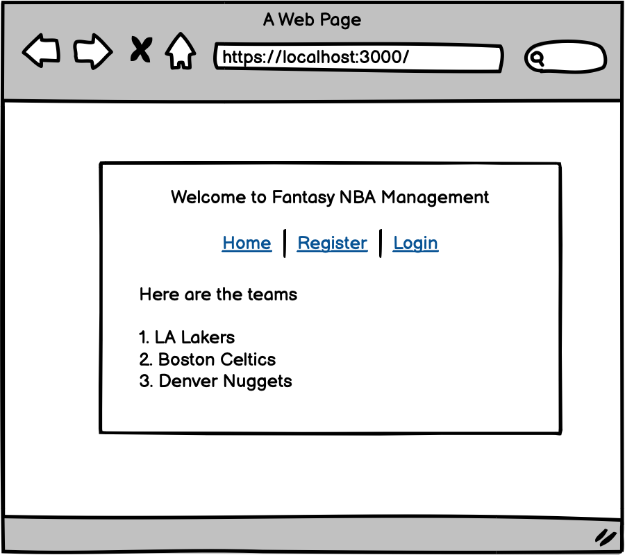
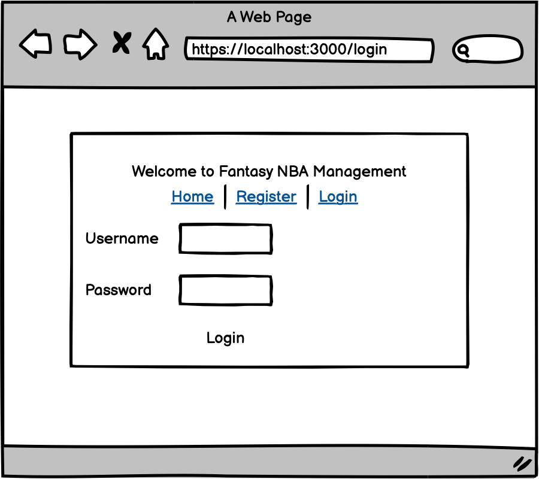
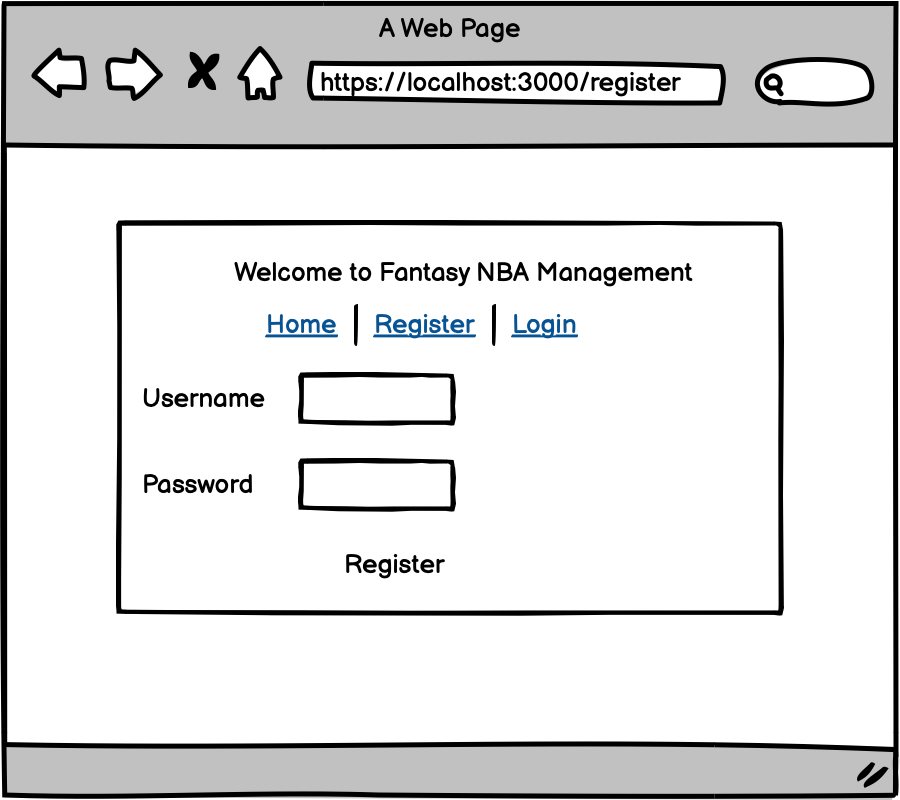
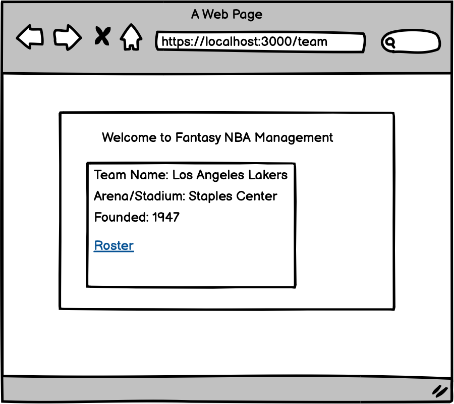
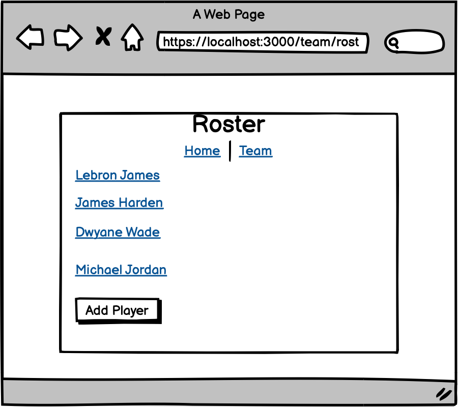
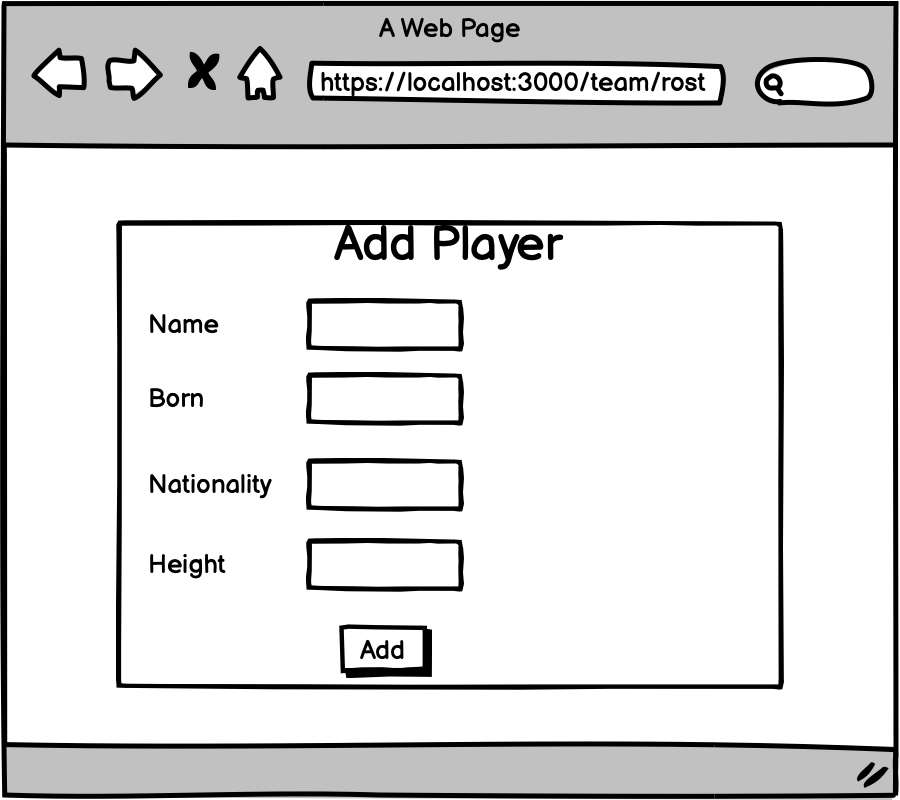
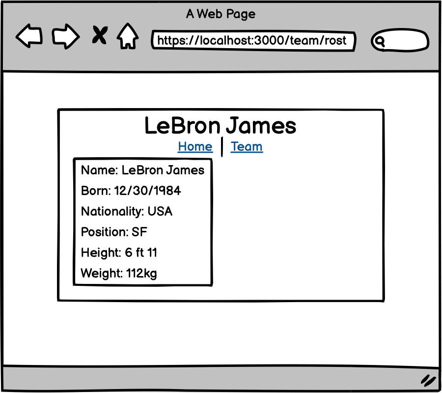
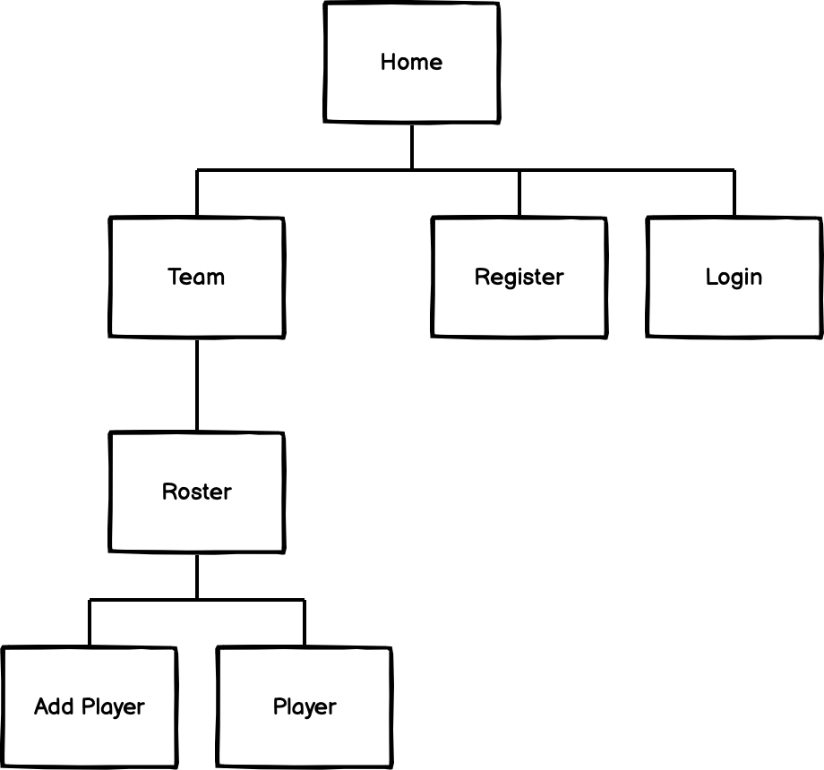

* See [example milestone #01](https://github.com/nyu-csci-ua-0480-008-spring-2017/final-project-example)
* Add images to your repository and link / display with markdown


The content below is an example project proposal / requirements document. Replace the text below the lines marked "__TODO__" with details specific to your project. Remove the "TODO" lines.

# Fantasy NBA Management 

## Overview

Fantasy NBA Management is a web application created for NBA fans. Users can create their own imaginary NBA team. First users will have to register their account. After they login, users can create their team and add players into the team. 

Users can decide on the attributes of both the team and the players. For example, users can decide on the team name, location of the team, and more. Users can also add/delete players. 


## Data Model

The application will store Users, Teams and Players

* A User can have one team with multiple players
* Each Team can have multiple players (by embedding)

An Example User:

```javascript
{
  username: "hsump1996",
  hash: // a password hash,
  Team: // a reference to a Team object
}
```

An Example Team:

```javascript
{
  team_name: "Los Angeles Lakers",
  arena_stadium: "Staples Center",
  players: // Embedded Players as an array
  location: "Los Angeles, California",
  founded: 1947
}
```

An Example Team with Embedded Players:

```javascript
{
  team_name: // a reference to a User object
  arena_stadium: "Staples Center",
  players: [
    { name: "Lebron James", born: 12/30/1984, nationality: "USA", position: "Small Forward", height: "6 ft 9 in", weight: "113 kg"},
    { name: "Carmelo Anthony", born: 02/10/1982, nationality: "USA", position: "Center", height: "6 ft 9 in", weight: "120 kg"},
  ],
  founded: 1947
}
```


An Example Player:

```javascript
{
  name: "Lebron James",
  born: 12/30/1984,
  nationality: "USA",
  position: "Small Forward",
  height: "6 ft 9 in",
  weight: "113 kg",
}
```


## [Link to Commented First Draft Schema](db.js) 


## Wireframes

/ - homepage



/login - login page



/register - register page



/team - page that displays team information



/team/roster/ - page that displays team roster



/team/roster/add - page that allows user to add players



team/roster/player-name - page that displays player information




## Site map





## User Stories or Use Cases

1. As non-registered user, I can register a new account with the site
2. As a user, I can log in to the site
3. As a user, I can create a new team
4. As a user, I can view all of the information regarding the team
5. As a user, I can view the roster(players) of the team
6. As a user, I can add players to the roster

## Research Topics

* (6 points) Integrate user authentication
    * I'm going to be using passport for user authentication
    * Will be setting up username and password with passport
* (2 points) Use a CSS framework throughout your site, use a reasonable of customization of the framework (don't just use stock Bootstrap - minimally configure a theme):
    * I'm going to be using Bootstrap 
    * Bootstrap
    * Create a specific theme for the entire pages

8 points total out of 8 required points 


## [Link to Initial Main Project File](app.js) 


## Annotations / References Used

1. [passport.js authentication docs](http://passportjs.org/docs) - (add link to source code that was based on this)
2. [Bootstrap docs](https://getbootstrap.com/) - (add link to source code that was based on this)
